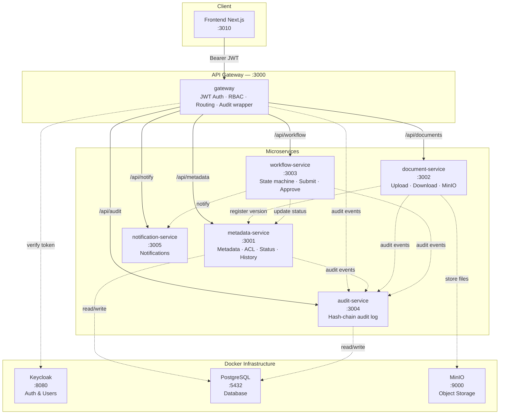
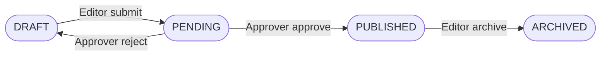
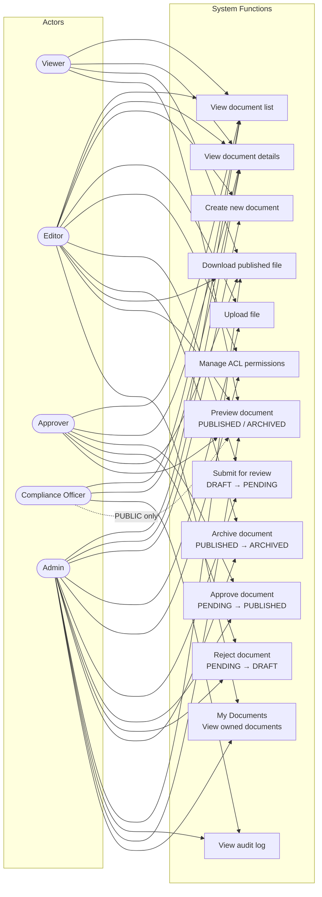

# DocVault

**DocVault** is an enterprise document management system built on a **microservices** architecture using NestJS. It supports the full document lifecycle: create → upload → review → publish → archive, with role-based access control (RBAC) and tamper-proof audit logging.

---

## System Architecture

### Layer Overview



### Document Lifecycle



---

## Use Case Diagram



> **Note:** Compliance Officer **cannot download files** regardless of any ACL permissions — this rule is enforced at the `metadata-service` layer. CO **can preview only PUBLIC** published/archived documents, but sees metadata (details) for all PUBLISHED and ARCHIVED documents for audit purposes.

### User Roles

| Role | Main Permissions |
|------|------------------|
| `viewer` | View list (PUBLIC), preview, download published files |
| `editor` | Create documents, upload files, submit for review, archive (own docs) |
| `approver` | Approve / reject documents, preview **all** classification levels |
| `compliance_officer` | View metadata for all PUBLISHED + ARCHIVED documents, view audit log, preview **PUBLIC only** — **cannot download files** |
| `admin` | Full access |

### Classification × Role Matrix

#### Document List Visibility

| Classification | viewer | editor | approver | CO | admin |
|---|:---:|:---:|:---:|:---:|:---:|
| `PUBLIC` | ✅ | ✅ | ✅ | ✅ | ✅ |
| `INTERNAL` | ❌ | ✅ | ✅ | ✅ | ✅ |
| `CONFIDENTIAL` | ❌ | ❌ | ✅ | ✅ | ✅ |
| `SECRET` | ❌ | ❌ | ✅ | ✅ | ✅ |

#### Document Preview

| Classification | viewer | editor | approver | CO | admin |
|---|:---:|:---:|:---:|:---:|:---:|
| `PUBLIC` | ✅ | ✅ | ✅ | ✅ | ✅ |
| `INTERNAL` | ✅ | ✅ | ✅ | ❌ | ✅ |
| `CONFIDENTIAL` | ❌ | ✅¹ | ✅ | ❌ | ✅ |
| `SECRET` | ❌ | ❌ | ✅ | ❌ | ✅ |

> ¹ Requires explicit ACL or is the owner

> Beyond the matrix above, a user always sees documents they **own** or have an **ACL entry** for — regardless of classification level.

---

## Installation Requirements

| Tool | Minimum Version |
|------|-----------------|
| Node.js | 18+ |
| pnpm | 8+ |
| Docker Desktop | 24+ |
| Git | any |

---

## Running the Project

### Quick Start — Single Command

```bash
pnpm install
pnpm --filter metadata-service db:seed
pnpm start:sequential
```

This script automatically starts **all services in the correct order**, polling the health endpoint before moving to the next service:

```
metadata-service (:3001) → document-service (:3002) → workflow-service (:3003)
  → notification-service (:3005) → audit-service (:3004) → gateway (:3000)
```

Optional steps (Prisma deploy, audit log migration) are skipped by default. Enable with:

```bash
RUN_PRISMA_DEPLOY=1 RUN_AUDIT_MIGRATION=1 pnpm start:sequential
```

Customize health-check timeout:

```bash
SERVICE_HEALTH_TIMEOUT_MS=180000 pnpm start:sequential
```

> Make sure Docker infra is already running (see Step 1 below).

---

### Detailed Step-by-Step

#### Step 1 — Install Dependencies

```bash
pnpm install
```

#### Step 2 — Start Infrastructure (Docker)

This starts: **PostgreSQL**, **MinIO**, **Keycloak** (with seeded realm & sample users).

```bash
docker compose -f infra/docker-compose.dev.yml --env-file infra/.env.example up -d
```

Wait for all containers to be **healthy** (about 30–60 seconds):

```bash
docker compose -f infra/docker-compose.dev.yml ps
```

> **Services after startup:**
> - PostgreSQL: `localhost:5432`
> - MinIO Console: [http://localhost:9001](http://localhost:9001) (user: `minioadmin` / `minioadminpw`)
> - Keycloak Admin: [http://localhost:8080](http://localhost:8080) (user: `admin` / `adminpw`)

#### Step 3 — Run Database Migrations

```bash
# metadata-service (PostgreSQL)
pnpm --filter metadata-service prisma:deploy

# audit-service (PostgreSQL)
pnpm --filter audit-service prisma:deploy
```

#### Step 3b — Seed Sample Data (first-time setup)

Populates the database with sample documents, ACL entries, and workflow history so the system is ready to use immediately.

```bash
pnpm --filter metadata-service db:seed
```

Sample data created:
- **Q1 Financial Report 2026** (CONFIDENTIAL, PUBLISHED)
- **Employee Handbook v3** (INTERNAL, PUBLISHED)
- **Product Roadmap 2026** (CONFIDENTIAL, DRAFT)
- **Meeting Notes — All Hands Feb** (PUBLIC, PUBLISHED)

#### Step 4 — Start Backend Services

Each service runs in its own terminal:

```bash
# Terminal 1 — metadata-service (port 3001)
pnpm --filter metadata-service start:dev

# Terminal 2 — document-service (port 3002)
pnpm --filter document-service start:dev

# Terminal 3 — workflow-service (port 3003)
pnpm --filter workflow-service start:dev

# Terminal 4 — audit-service (port 3004)
pnpm --filter audit-service start:dev

# Terminal 5 — notification-service (port 3005)
pnpm --filter notification-service start:dev

# Terminal 6 — gateway (port 3000) — start LAST
pnpm --filter gateway start:dev
```

> **Important order:** Gateway must start **after** all other services are ready.

#### Step 5 — Start Frontend

```bash
cd apps/web

# Copy env file
cp .env.example .env.local

# Run dev server
npx next dev -p 3010
```

Open browser: [http://localhost:3010](http://localhost:3010)

---

## Testing the System

### Run E2E Checks for the Full BE Flow

```bash
node scripts/e2e-check.mjs
```

Includes:
- No token → 401
- Expired token → 401
- Viewer creates document → 403
- Editor creates + uploads → 201, file stored in MinIO ✅
- Viewer downloads draft → 403
- Editor submits → PENDING
- Approver approves → PUBLISHED
- Approve again → 409 Conflict
- Viewer downloads PUBLISHED → 200
- Compliance Officer downloads file → 403
- Compliance Officer views audit → 200
- Viewer views audit → 403

### API Swagger

With services running:

| Service | Swagger UI |
|---------|-----------|
| Gateway | [http://localhost:3000/docs](http://localhost:3000/docs) |
| metadata-service | [http://localhost:3001/docs](http://localhost:3001/docs) |
| document-service | [http://localhost:3002/docs](http://localhost:3002/docs) |
| workflow-service | [http://localhost:3003/docs](http://localhost:3003/docs) |
| audit-service | [http://localhost:3004/docs](http://localhost:3004/docs) |
| notification-service | [http://localhost:3005/docs](http://localhost:3005/docs) |

---

## Demo Accounts (Keycloak)

Password for all accounts: **`Passw0rd!`**

| Username | Role | Description |
|----------|------|-------------|
| `viewer1` | viewer | View & download published documents |
| `editor1` | editor | Create, upload, submit documents |
| `approver1` | approver | Approve / reject documents |
| `co1` | compliance_officer | View audit log (cannot download files) |
| `admin1` | admin | Full access |

### Get JWT Token from Keycloak

```bash
curl -s -X POST \
  http://localhost:8080/realms/docvault/protocol/openid-connect/token \
  -H "Content-Type: application/x-www-form-urlencoded" \
  -d "client_id=docvault-gateway&client_secret=dev-gateway-secret&grant_type=password&username=editor1&password=Passw0rd!" \
  | jq -r '.access_token'
```

---

## Core Business Flows

### Upload and Publish Document

```
Editor                    Gateway              Services
  │                          │                    │
  ├─ POST /api/metadata/documents ──────────────► │ Create metadata (DRAFT)
  ├─ POST /api/documents/:id/upload ────────────► │ Upload to MinIO
  ├─ POST /api/workflow/:id/submit ────────────► │ DRAFT → PENDING
  │                                               │
Approver                                          │
  ├─ POST /api/workflow/:id/approve ────────────► │ PENDING → PUBLISHED
  │                                               │
Viewer                                            │
  └─ POST /api/documents/:id/presign-download ──► │ Get download URL
```

### Compliance Flow

```
Compliance Officer   Gateway         metadata-service
  │                    │                    │
  ├─ GET /api/metadata/documents ──────────► │ View list → 200 ✅
  ├─ GET /api/audit/query ─────────────────► │ View audit log → 200 ✅
  └─ POST /api/documents/:id/presign-download │ Download file → 403 ❌ (always blocked)
```

---

## Directory Structure

```
docvault/
├── apps/
│   └── web/                    # Frontend Next.js 15
├── services/
│   ├── gateway/                # API Gateway (NestJS, port 3000)
│   ├── metadata-service/       # Metadata & ACL management (port 3001)
│   ├── document-service/       # Upload/Download via MinIO (port 3002)
│   ├── workflow-service/       # Document review state machine (port 3003)
│   ├── audit-service/          # Tamper-proof audit log (port 3004)
│   └── notification-service/   # Notifications (port 3005)
├── infra/
│   ├── docker-compose.dev.yml  # Infra: Postgres, MinIO, Keycloak
│   ├── .env.example            # Sample infra config
│   └── keycloak/               # Realm config & seed users
├── scripts/
│   ├── e2e-check.mjs           # Automated E2E check script
│   ├── start-sequential.mjs   # Sequential startup script for all services
│   └── demo.sh                 # Demo script
└── docs/
    ├── TEAM_SETUP_DEPLOYMENT_GUIDE.md # Team setup, CI/CD, EKS and PR checklist
    ├── demo-users.md           # Account & permission info
    ├── demo-flow.md            # Step-by-step demo scenarios
    ├── ERD.md                  # Entity Relationship Diagram
    ├── PROJECT_STATUS.md       # Project status & known gaps
    └── verification-report.md # Integration check report
```

---

## Data Model

### Database `docvault_metadata` (PostgreSQL)

- `documents` — metadata, tags, classification, status, publishedAt, archivedAt
- `document_versions` — pointers to file versions stored in MinIO
- `document_acl` — access control (USER / ROLE / GROUP)
- `document_workflow_history` — status transition history

### Database `docvault_audit` (PostgreSQL)

- `audit_events` — audit events with **SHA-256 hash chain** for tamper proofing

### Database `docvault_metadata` — Document Comments

- `document_comments` — comments/notes on documents (authorId, content, timestamp)

---

## Advanced Features

### Bulk Actions

Select multiple documents in the table and perform batch operations:

- **Bulk Submit**: Select multiple DRAFT → Submit all at once
- **Bulk Approve**: Approver selects multiple PENDING → Batch approve
- **Bulk Archive**: Select multiple PUBLISHED → Archive simultaneously

> Results displayed via toast: `"Bulk Submit: 3 succeeded, 1 failed"`.

### Document Comments

All users with document view permission can leave comments/notes:

- Displayed on document detail page (right column)
- Supported across all roles: viewer, editor, approver, CO, admin
- API: `GET/POST /api/metadata/documents/:docId/comments`

### Full-text Search (Server-side)

Search documents by title, description, and tags:

- Search processed server-side (PostgreSQL ILIKE) → efficient with large datasets
- API: `GET /api/metadata/documents?q=keyword`
- Frontend automatically sends query to server when typing in the search box

### My Documents

Editor/Admin has a dedicated `/my-documents` page showing only their owned documents:

- Sidebar menu: **My Documents** (FolderOpen icon)
- Auto-filtered by `ownerId` — easy personal document management
- Full support: bulk actions, filters, submit/archive

---

## Important Notes

- **Compliance Officer** is always denied file downloads, even if ACL permits it (logic in `metadata-service/policy.service.ts`). CO **can only preview PUBLIC documents**, but sees metadata (details) for all PUBLISHED and ARCHIVED documents for audit purposes.
- **Approver** is the highest non-admin permission — can preview documents at **all** classification levels.
- **Preview** supports `PUBLISHED` and `ARCHIVED` documents. PDFs are rendered via `pdf.js` (canvas) — no download button, no right-click save.
- **Archive** is only available to editors who own the document or admins (not approvers). ARCHIVED documents **can only be previewed**, not downloaded.
- **Classification Visibility**: PUBLIC (all) → INTERNAL (editor+) → CONFIDENTIAL (approver+) → SECRET (approver+). CO sees all PUBLISHED (metadata only).
- **Bulk Actions** supports batch Submit, Approve, Archive — each doc is called via sequential API.
- **Document Comments** stored in the `document_comments` table — unlimited comments.
- Gateway automatically logs audit for every request received.
- Document status flow: `DRAFT` → `PENDING` → `PUBLISHED` → `ARCHIVED`.
