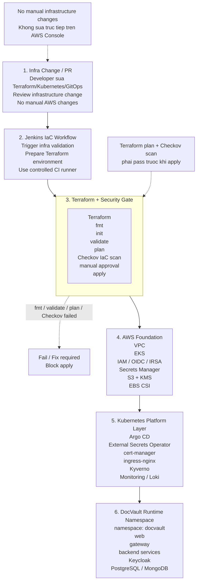

# Luong trien khai ha tang AWS/EKS bang Terraform cho DocVault

So do nay mo ta quy trinh tao/cap nhat ha tang AWS/EKS bang Terraform. Cach ve theo dang pipeline 6 buoc: thay doi ha tang di qua PR, Jenkins chay validation, Terraform tao AWS foundation, sau do EKS nhan lop platform va namespace ung dung.

## So do Mermaid

## Ket qua sau khi Terraform apply

- VPC va subnet san sang cho EKS va load balancer.
- EKS cluster `docvault-eks` va managed node group `docvault-ng` duoc tao.
- EKS add-ons co san: CoreDNS, kube-proxy, VPC CNI, AWS EBS CSI driver.
- IAM/OIDC/IRSA roles san sang cho External Secrets Operator, document-service va cac backup workloads.
- S3/KMS resources san sang cho document storage va database backup.
- Operator co the chay `aws eks update-kubeconfig` roi bootstrap Argo CD/GitOps.

## Ghi chu theo repo hien tai

- Terraform root stack: `infra/terraform/aws-eks`.
- EKS cluster mac dinh: `docvault-eks`.
- Node group: `docvault-ng`, instance type mac dinh `t3.large`, min/desired/max `1/2/3`.
- VPC CIDR mac dinh: `10.20.0.0/16`.

