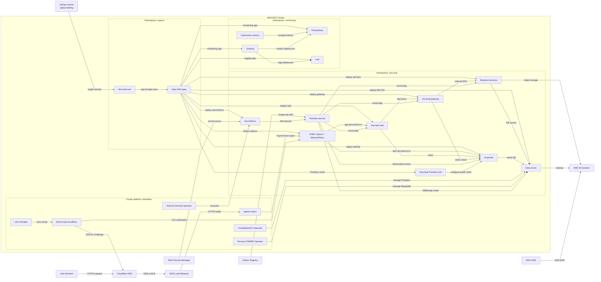

# So do DevSecOps Pipeline DocVault bang Mermaid

Ban rut gon khuyen nghi cho bao cao: 3 so do. Cac so do Jenkins flow, security gates va GitOps flow duoc gop lai vi cung mo ta mot chuoi CI/CD o cac muc zoom gan nhau; kien truc Kubernetes duoc gop thanh mot hinh day du nhung chi giu cac duong noi chinh.

## 1. Luong DevSecOps CI/CD tong hop

So do nay gop cac y: Jenkins pipeline, quality gates, security gates, build image, GitOps deploy va post-deploy validation.

```mermaid
flowchart LR
  Dev["Developer"] --> Git["GitHub Repository"]
  Git --> Jenkins["Jenkins Pipeline"]

  subgraph CI["CI validation"]
    Jenkins --> Init["Checkout & Initialize Config"]
    Init --> PreventLoop["Prevent Loop"]
    PreventLoop --> Detect["Detect Changes"]
    Detect --> SystemCheck["System Check"]

    SystemCheck --> SecretScan["Secret Scan"]
    SecretScan --> Quality["Quality Gates<br/>Install, Lint, Unit Test, Build"]
    Quality --> SecGates["Security Gates<br/>SCA, SAST, Trivy FS, IaC policy"]
    SecGates --> BuildScan["Build & Scan Images<br/>Docker Build + Trivy Image"]
  end

  BuildScan --> ReleaseDecision{"Release branch<br/>and changes exist?"}
  ReleaseDecision -->|No| CIResult["CI result<br/>pass, fail, or unstable"]

  subgraph CD["CD by GitOps"]
    ReleaseDecision -->|Yes| PushHarbor["Push images to Harbor"]
    PushHarbor --> UpdateGitOps["Update GitOps branch<br/>Helm values tag/digest"]
    UpdateGitOps --> ArgoCD["Argo CD sync"]
    ArgoCD --> EKS["AWS EKS / Kubernetes"]
  end

  subgraph Validate["Post-deploy validation"]
    EKS --> ArgoHealth["Argo CD Synced/Healthy"]
    ArgoHealth --> Smoke["Smoke Test"]
    Smoke --> DAST["Optional OWASP ZAP DAST"]
    DAST --> Evidence["Pipeline result and evidence"]
  end

  SecretScan -->|Secret found| Stop["Block pipeline"]
  SecGates -->|Gate failed| Stop
  BuildScan -->|Critical image vuln| Stop
  DAST -->|High risk finding| Stop
```

## 2. Container supply chain va GitOps promotion

So do nay tap trung vao duong di cua artifact: source change -> image -> registry -> digest/signature -> Helm values -> Argo CD deployment.

```mermaid
flowchart LR
  Change["Detected changed files"] --> Select["Select impacted targets<br/>web/services/libs/infra"]
  Select --> Build["Docker Build<br/>BuildKit + registry cache"]
  Build --> Image["Image tagged by Git SHA"]
  Image --> Trivy["Trivy Image Scan"]

  Trivy --> VulnDecision{"CRITICAL vuln?"}
  VulnDecision -->|Yes| Fail["Fail pipeline"]
  VulnDecision -->|No| Push["Push image to Harbor"]

  Push --> Harbor["Harbor Registry<br/>harbor.docvault.id.vn/docvault-dev"]
  Harbor --> Digest["Resolve immutable digest"]

  Digest --> SignDecision{"SIGN_IMAGES=true?"}
  SignDecision -->|Yes| Cosign["Cosign sign digest"]
  Cosign --> VerifyDecision{"Public key configured?"}
  VerifyDecision -->|Yes| Verify["Cosign verify signature"]
  VerifyDecision -->|No| Values["Update Helm values"]
  Verify --> Values

  SignDecision -->|No| Values
  Values --> GitOps["Commit to gitops-testing<br/>repository, tag, digest"]
  GitOps --> ArgoCD["Argo CD watches GitOps branch"]
  ArgoCD --> Sync["Sync desired state to EKS"]
```

## 3. Kien truc trien khai tren AWS EKS

So do nay la ban cuoi dung cho bao cao: du cac thanh phan trien khai chinh tren AWS EKS, nhung gom cac workload/secrets theo nhom de tranh qua nhieu duong noi. Cac chi tiet gom duoc ghi chu ngay ben duoi so do.

Ghi chu cac node gom:

- `Argo child apps`: `docvault-infra-deps`, cac app Helm cho workload DocVault, `docvault-public-ingress`, `audit-mongodb-percona`, `monitoring-stack`, `loki-stack`.
- `Backend services`: `metadata-service`, `document-service`, `workflow-service`, `audit-service`, `notification-service`.
- `Data stores`: `metadata-postgres`, `keycloak-postgres`, `audit-mongodb`.
- `Runtime secrets`: `docvault-app-secrets`, `keycloak-secret`, DB/Mongo credentials va Harbor image pull secret.
- `AWS S3 buckets`: bucket tai lieu, bucket backup CNPG metadata Postgres va bucket backup Percona MongoDB; duoc ma hoa bang AWS KMS.
- `Loki`: da duoc deploy, nhung `Promtail` dang tat nen so do khong ve luong thu log tu pod sang Loki.
